# Path Finder 게임 진행 가이드

각 플레이어마다 역할이 주어집니다. 금을 __찾아내어/못찾도록 유도하여__ 승리를 쟁취하세요!
  - 광부: 방해꾼의 방해를 피해 금을 찾아내세요!
  - 방해꾼: 절대 금을 발견하지 못하도록 길을 유도하세요!

## 접속 방법
[Path Finder 게임 서버](https://www.acronsoft.shop:8443)에 접속합니다.

> 💡페이지에 접속이 안될 경우 서버 관리자에게 연락 부탁드립니다.\
> 서버 관리자: 김도훈

> 💡테스트 시 관리자 페이지를 이용하여 게임을 조작하실 수 있습니다.\

## 로그인
1. 닉네임의 제한은 3자 이상, 16자 이하입니다.
2. 로그인 후 로비로 이동됩니다.

## 로비에서 방 생성

1. 빠른 매칭: 열려 있는 방 중, 조건에 맞는 방을 찾아 자동으로 참여합니다.
2. 방 생성: 새로이 방을 생성합니다.
3. 방 코드 검색: 생성되어 있는 방의 코드를 입력하여 참여합니다. 코드는 알파벳 대문자 4글자로 이뤄집니다.
>💡 "카드 배치 도우미"\
>게임 화면에서 카드 배치를 도와주는 역할을 합니다.

## 대기실
>💡 대기실에 들어오면 음성채팅이 활성화 됩니다.
1. 대기중인 플레이어와 부족한 플레이어 수가 표시됩니다.
2. 게임 인원이 가득 차면 카운트다운 이후 게임이 자동으로 시작됩니다.

## 게임 화면 설명

1. 가장 왼쪽에 **플레이어 리스트**가 있습니다. 
    - 각 플레이어의 파괴/수리 상태, 핸드에 있는 카드의 수를 확인할 수 있습니다. 금은 본인의 개수만 보여집니다.
    - 현재 라운드가 표시됩니다.
2. 플레이어 리스트 아래에 **룰북과 사운드조절 버튼**이 있습니다.
    - 룰북은 언제든지 눌러 규칙 확인이 가능합니다.
    - 사운드 조절 버튼을 눌러 게임 사운드를 조정할 수 있습니다.
3. 중앙 상단에는 **현재 턴의 플레이어 정보**가 표시됩니다.
4. 중앙에는 **카드가 놓여지는 보드**가 표시됩니다.
    >키보드의 방향키를 이용하여 보드를 이동할 수 있습니다.
5. 중앙 하단에는 **버리기 영역, 본인의 핸드, 회전 영역**이 있습니다.
6. 우측에는 **나의 역할, 턴의 남은 시간, 덱의 남은 카드, 그리고 게임 로그**가 보여집니다.
    - 플레이어는 각각 본인의 역할을 확인할 수 있습니다.
    - 각 턴의 남은 시간이 표시됩니다. 30초의 제한시간이 주어집니다.
    - 덱의 카드가 0장이 되면 새로이 카드를 지급하지 않습니다. 핸드의 카드가 없어질 때까지 게임이 지속됩니다.
    - 게임 로그로 플레이어 전체가 취한 행동을 관측할 수 있습니다.
    >💡게임 로그에 마우스 커서를 올릴 시 해당 행동의 좌표가 보드에 표시됩니다.

## 게임 방법
게임 진행은 드래그&드랍으로 이루어집니다.
1. 30초 내에 행동을 완료해야 합니다.
    - 턴 제한시간을 초과하면 카드는 자동으로 버려집니다.
    - 유효한 행동이 완료될 경우 자동으로 턴이 넘어갑니다.
1. 카드 버리기는 **버리기 영역에 드랍**하여 사용합니다.
    - 버리기 영역에 카드를 드랍하면 카드가 버려집니다.
    
1. 굴카드 회전은 **회전 영역에 드랍**하여 사용합니다.
    - 회전 영역에 카드를 드랍하면 카드가 180도 회전됩니다.
    
1. 굴 카드는 **보드 위에 드랍**하여 사용합니다.
    - 출발지에서 이어지는 길의 위치에만 카드를 놓을 수 있습니다.
    >💡게임방 설정의 "카드 배치 도우미"를 활성화 한 경우에만 굴 카드를 놓을 수 있는 위치가 표시됩니다.
    
2. 파괴 카드는 **보드 위에 드랍**하여 사용합니다. \
적용할 
플레이어를 클릭하고 확인 버튼을 누릅니다.
    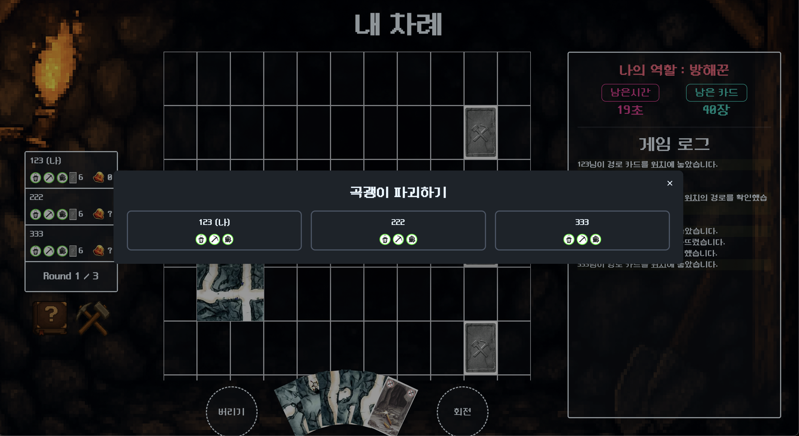
3. 수리 카드는 **보드 위에 드랍**하여 사용합니다. \
적용할 플레이어를 클릭하고 확인 버튼을 누릅니다.
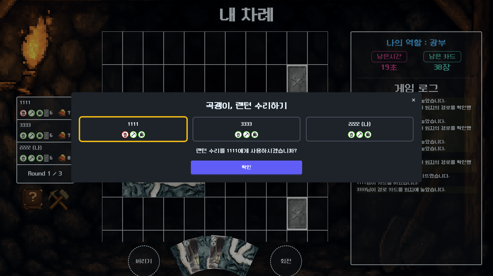
3. 낙석카드는 **보드 위의 목표 카드 위에 드랍**하여 사용합니다. \
길 카드는 바로 삭제됩니다.

4. 지도 카드는 **보고 싶은 목적지 위에 드랍**하여 사용합니다. \
10초 후 모달이 자동으로 닫힙니다.
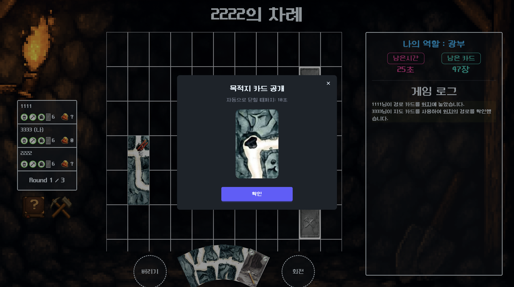
5. 금을 찾거나, 모든 카드를 사용했을 경우 라운드가 종료됩니다.
    - 광부가 승리할 경우, 광부에게만 금이 지급됩니다.
    - 방해꾼이 승리할 경우, 방해꾼에게만 금이 지급됩니다.
    - 광부 승리 시 방해꾼 시점
    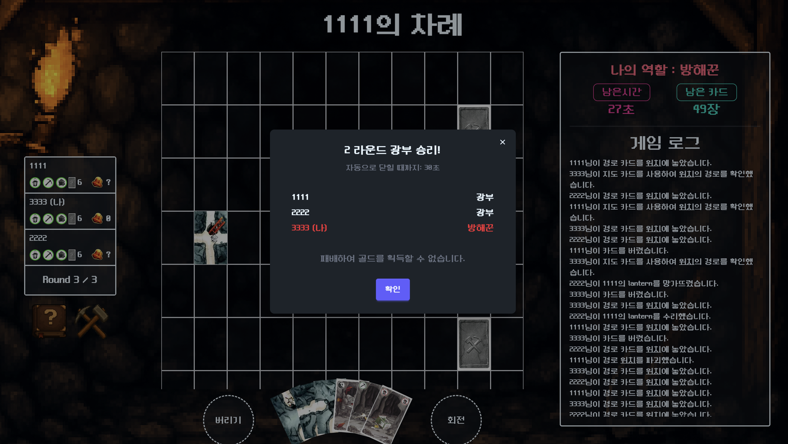
    - 광부 승리 시 광부 시점
    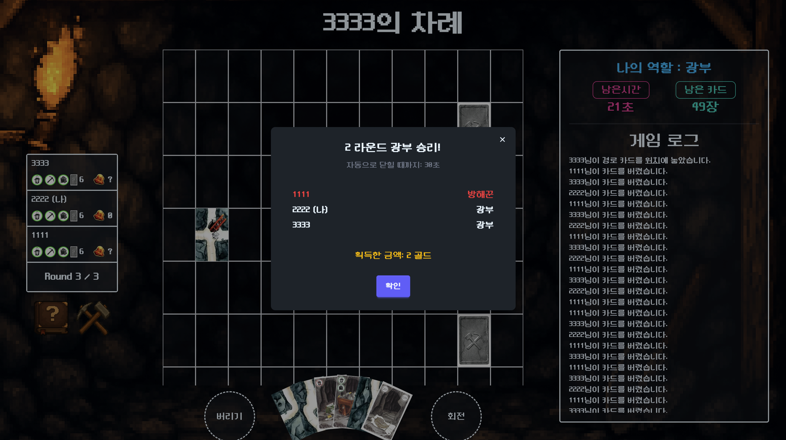
    - 방해꾼 승리 시 방해꾼 시점
    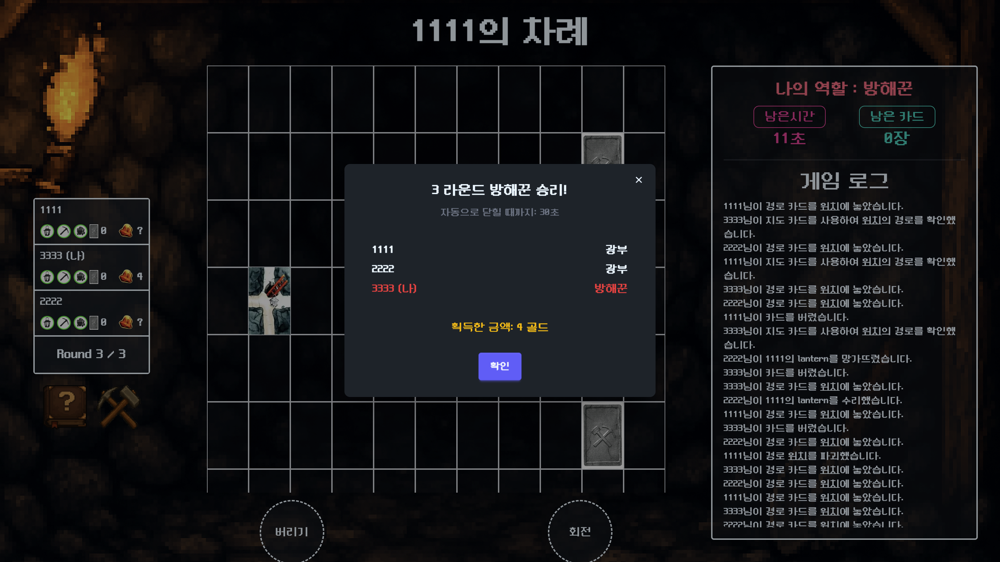
    - 방해꾼 승리 시 광부 시점
    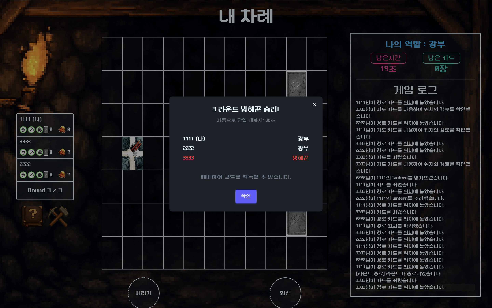
6. 3 라운드가 종료된 후, 플레이어 각각이 얻은 골드 수가 밝혀집니다.
    - 약 60초 후에 게임이 자동으로 시작됩니다.
    - “로비로 나가기” 버튼을 눌러 방을 나갈 수 있습니다.
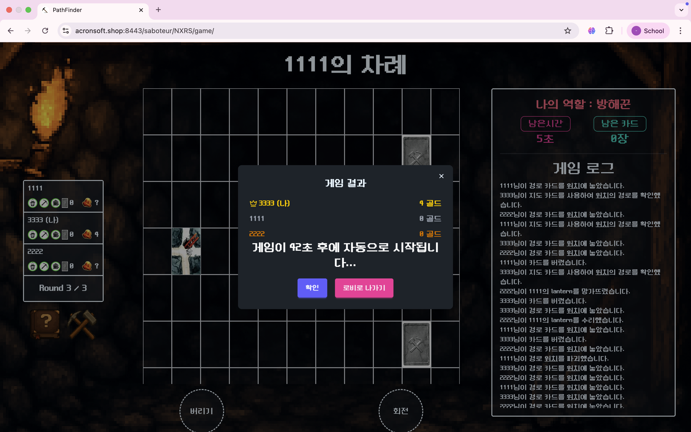

# 추가 기능
## 관리자 페이지
클라이언트 페이지를 이용하여 게임 방을 만들고, 방 코드를 검색하여 참여할 수 있습니다.
1. [Path Finder 게임 관리자 페이지](https://www.acronsoft.shop:3000/)페이지에 접속합니다.
    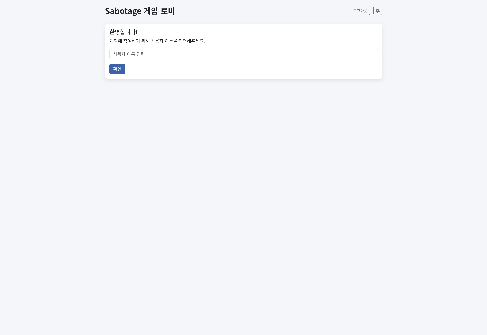
2. server 계정으로 로그인합니다.
3. 방 코드 검색으로 방에 참여합니다.
    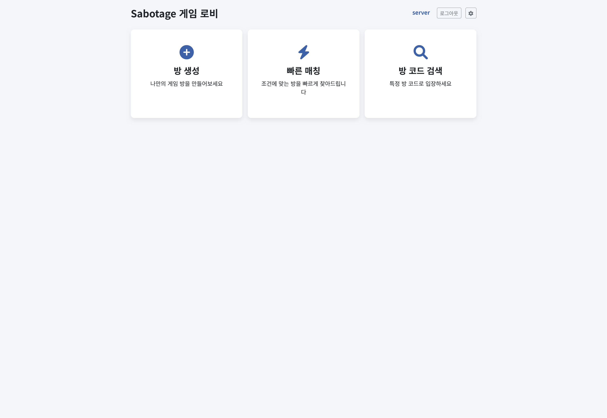
> server외 계정으로 로그인 시 테스트페이지로 이동하여 동일한 서버 내에서 게임을 즐기실 수 있습니다. \
>모바일 환경에서도 제한적이지만 플레이 가능
4. 방에 참여 후, 게임을 관전할 수 있습니다.
    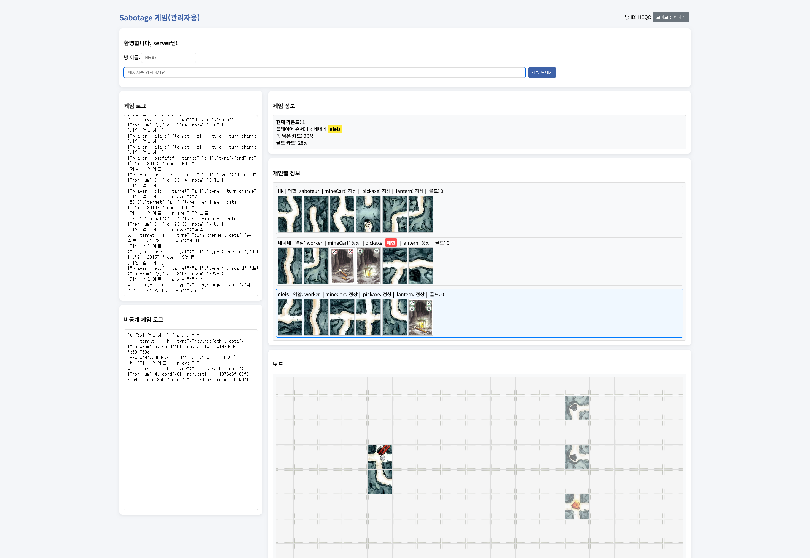
    1. 모든 플레이어의 상태와 행동을 확인할 수 있습니다.
    2. 게임 로그를 통해 플레이어의 행동을 확인할 수 있습니다.
    3. 상단 메세지 입력창에 각종 관리자 명령어를 전송하여 게임을 조작할 수 있습니다.
        - `/changecard <playerName:str> <handIndex:0-5> <cardNum:1-> <회전여부:true/false(defualt)>`: 플레이어의 핸드를 변경합니다.\
        ex) `/changecard 도훈 0 3 true`
        ex) `/changecard 도훈 0 3 `
        - `/changecardcurrent <cardNum:1-> <회전여부:true/false(defualt)>`: 현재 턴 플레이어의 핸드를 변경합니다.\
        ex) `/changecardcurrent 3 true`
        ex) `/changecardcurrent 3 `
        - `/changeround <roundNum:1-3>`: 현재 라운드를 변경합니다.\
        ex) `/changeround 2`
        - `/clearcards`: 모든 플레이어의 핸드를 한 장씩 남기고, 공용덱의 카드를 삭제합니다. 

            <!-- 토글에 숨기기 -->
            

            
카드번호 보기

            | 번호 | 이미지| 설명(참고)| 번호 | 이미지| 설명(참고)|
            |-----|----------------|--------------------------|-----|----------------|--------------------------|
            | 1   | | Way2D (세로 길)| 17  | 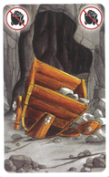| 수레 파괴|
            | 2   | | Way3B (3방향 - 서쪽 제외)| 18  | 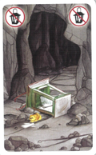| 램프 파괴|
            | 3   | | Way4 (4방향 모두)        | 19  | 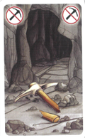| 곡괭이 파괴|
            | 4   | | Way3A (3방향 - 북쪽 제외)| 20  | 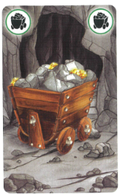| 수레 수리|
            | 5   | | Way2C (가로 길)          | 21  | 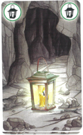| 램프 수리|
            | 6   | | Way2A (남동쪽)           | 22  | 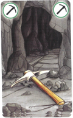| 곡괭이 수리|
            | 7   | | Way2B (북동쪽)           | 23  | 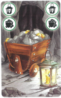| 수레+램프 수리|
            | 8   | | Way1A (동쪽만)           | 24  | 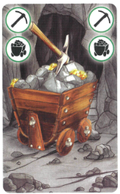| 수레+곡괭이 수리|
            | 9   | | Way1B (서쪽만)           | 25  | 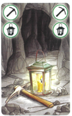| 램프+곡괭이 수리|
            | 10  | | Way1C (남쪽만)           | 26  | 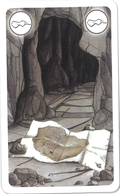| 지도 보기|
            | 11  | | Way1D (북쪽만)           | 27  | 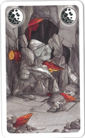| 파괴|
            | 12  | | Way1E (동서)             |
            | 13  | | Way1F (남북)             |
            | 14  | | Way1G (동남)             |
            | 15  | | Way1H (동북)             |
            | 16  | | Way1I (서남)             |
            
